# GoBirdie Android User's Manual

## Table of Contents

1. [Starting a Round](#1-starting-a-round)
2. [Playing a Hole](#2-playing-a-hole)
3. [Using the Map](#3-using-the-map)
4. [Putting & Finishing a Hole](#4-putting--finishing-a-hole)
5. [Reviewing Scorecards](#5-reviewing-scorecards)
6. [Settings](#6-settings)
7. [Wear OS Watch](#7-wear-os-watch)
8. [Exploring Courses](#8-exploring-courses)
9. [Tips](#tips)

---

## 1. Starting a Round

<table>
<tr><td valign="top" width="60%">

### Step 1: Open GoBirdie

Open the app and you'll see the initial screen with no active round. Tap **Start a Round** to begin.

</td><td valign="top">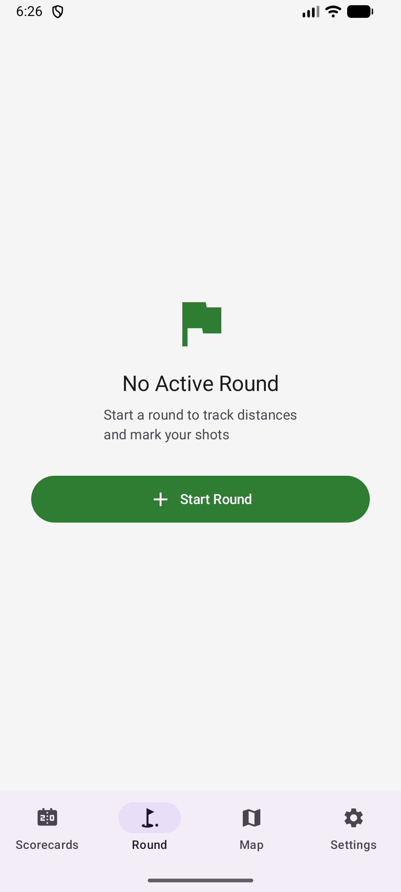</td></tr>
</table>

<table>
<tr><td valign="top">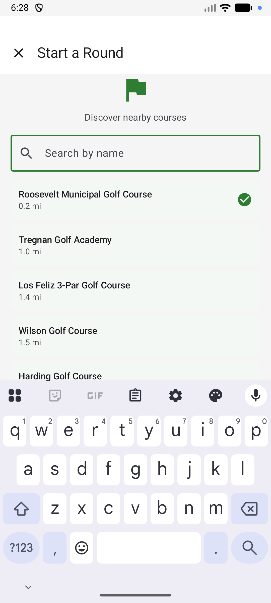</td><td valign="top" width="60%">

### Step 2: Find Your Course

Nearby courses are listed automatically, sorted by distance. Previously downloaded courses appear instantly while online results load in the background.

</td></tr>
</table>

<table>
<tr><td valign="top" width="60%">

### Step 3: Search by Name (Optional)

If your course isn't listed, tap the search bar and type the course name. Results are fetched from OpenStreetMap with a large search radius.

</td><td valign="top">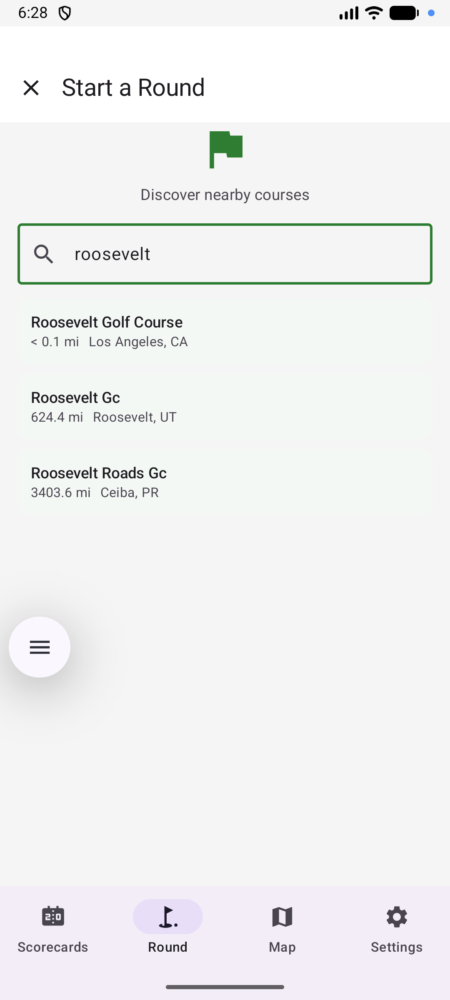</td></tr>
</table>

<table>
<tr><td valign="top">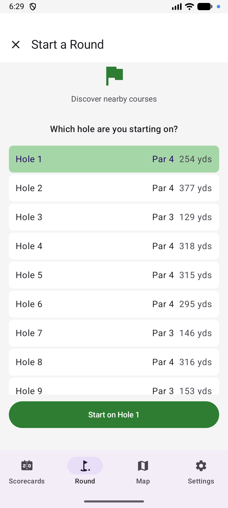</td><td valign="top" width="60%">

### Step 4: Select Your Starting Hole

After selecting a course, choose which hole to start from. This is useful if you're starting on the back nine or a specific hole.

</td></tr>
</table>

<table>
<tr><td valign="top" width="60%">

### Step 5: Begin the Round

Once you've selected the course and starting hole, the round begins. You'll see the distance display at the top and the mini scorecard at the bottom.

</td><td valign="top">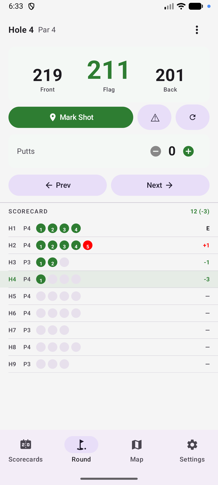</td></tr>
</table>

---

## 2. Playing a Hole

<table>
<tr><td valign="top">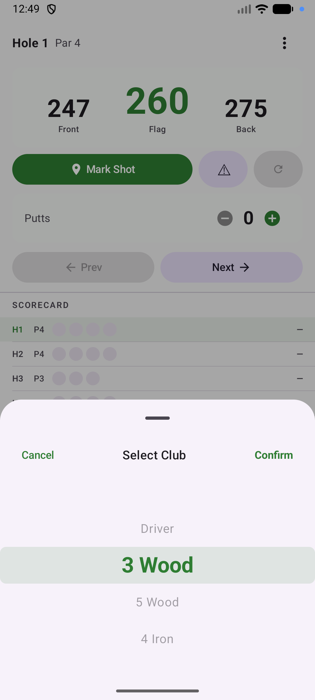</td><td valign="top" width="60%">

### Step 6: Select Your Club

After each shot, tap **Mark Shot** to drop a GPS pin at your current location. A club selection sheet appears — pick the club you used. You can customize the club list in Settings → My Clubs.

</td></tr>
</table>

<table>
<tr><td valign="top" width="60%">

### Step 7: Track Your Progress

Your shots appear on the map as colored dots connected by lines. Each line shows the distance in yards between shots. The current hole's info (par, yardage, handicap) is displayed at the top, and the mini scorecard tracks your running score at the bottom.

</td><td valign="top">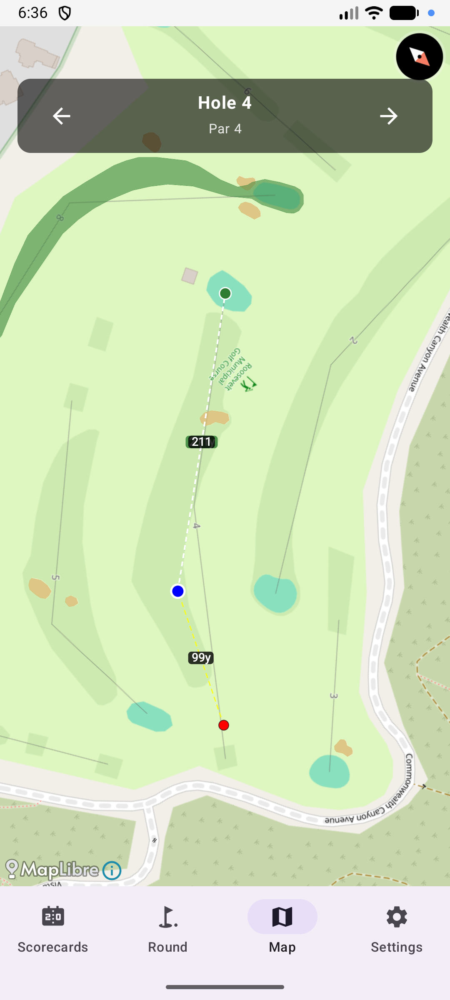</td></tr>
</table>

---

## 3. Using the Map

<table>
<tr><td valign="top"></td><td valign="top" width="60%">

### Step 8: Read Distances

The map automatically rotates and zooms to show the hole from tee to green. Your position is shown as a blue pulsing dot, and the green is marked with a green dot. A dashed line shows the distance from you to the pin. Front, Flag, and Back distances are displayed at the top.

</td></tr>
</table>

---

## 4. Putting & Finishing a Hole

<table>
<tr><td valign="top">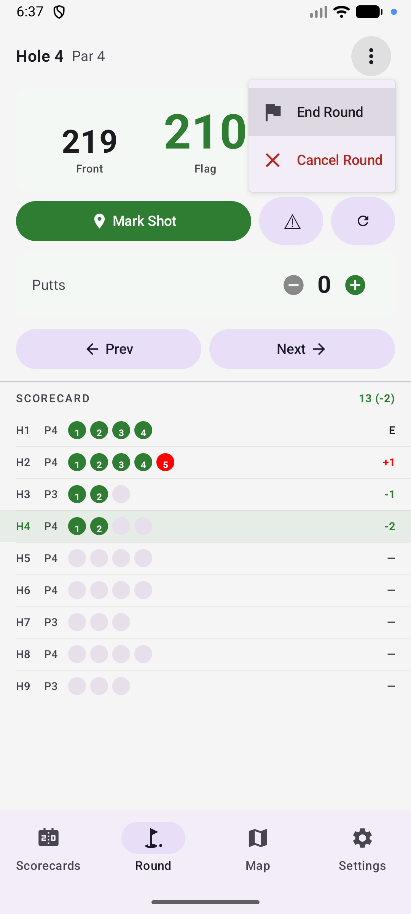</td><td valign="top" width="60%">

### Step 9: Enter Putts

Enter number of putts with + / − buttons and tap next to move to the next hole. The Finish button shows up on the last hole to end and save the round. The menu button on the top-right corner shows End Round / Cancel Round which can be used any time during the round.

</td></tr>
</table>

<table>
<tr><td valign="top" width="60%">

### Step 10: Navigate Between Holes

Use the **< >** arrows in the hole info bar to move between holes. You can go back to a previous hole to correct a score if needed. On the last hole, advancing ends the round.

</td></tr>
</table>

---

## 5. Reviewing Scorecards

<table>
<tr><td valign="top" width="60%">

### Step 11: View Past Rounds

Tap the **Scorecards** tab to see all completed rounds. Each card shows the course name, date, total score, and score vs par. Swipe left on a round to delete it.

</td><td valign="top">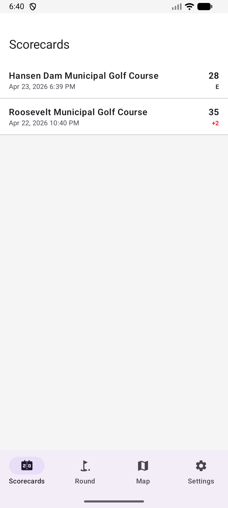</td></tr>
</table>

<table>
<tr><td valign="top">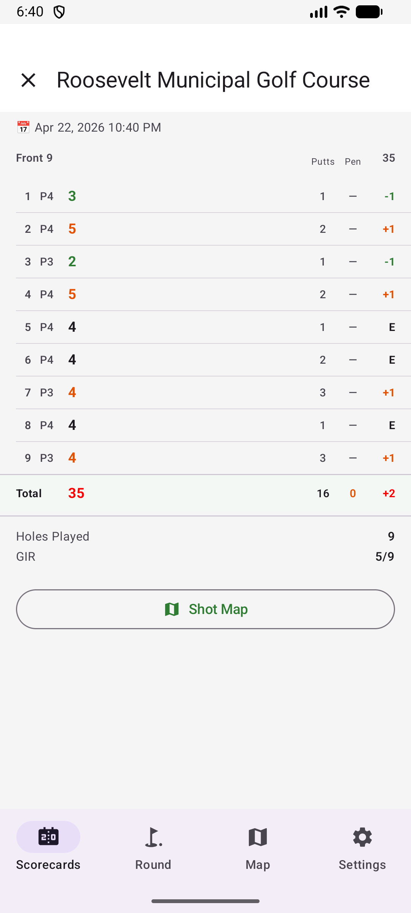</td><td valign="top" width="60%">

### Step 12: Scorecard Detail

Tap a round to see the full scorecard with Front 9 / Back 9 tables, per-hole breakdown (score, putts, fairway hit), totals, and stats like GIR. Scores are color-coded: green for birdie, orange for bogey, red for double bogey or worse.

</td></tr>
</table>

<table>
<tr><td valign="top" width="60%">

### Step 13: Shot Map

Scroll down in the scorecard detail to see the shot map. Each hole's shots are plotted on the map with club-colored dots, distance lines, and a putt count at the green. The map is rotated to align tee-to-green vertically. Navigate between holes using the **< >** arrows.

</td><td valign="top">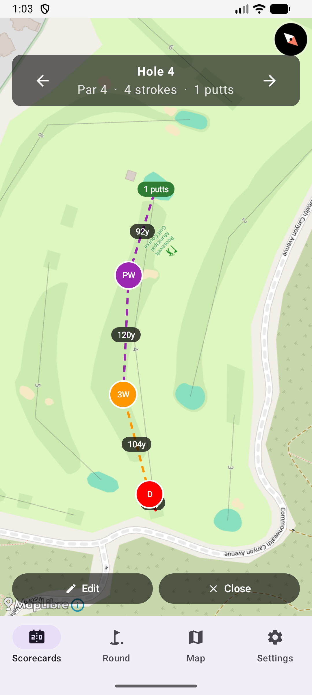</td></tr>
</table>

<table>
<tr><td valign="top">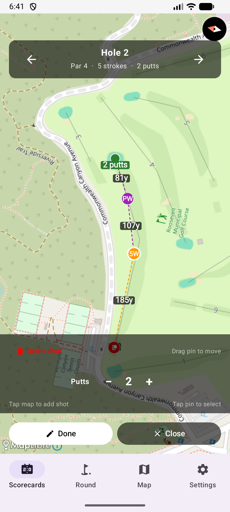</td><td valign="top" width="60%">

### Step 14: Edit Shot Map

Tap **Edit** in the shot map view to adjust shot locations, club selections, or putt count. Drag pins to move shots, tap to select and delete shots, tap on the map to add new shots, and use the **+/−** buttons to adjust putts. Changes are saved when you tap **Done**.

</td></tr>
</table>

---

## 6. Settings

<table>
<tr><td valign="top" width="60%">

### Step 15: Settings Overview

Tap the **Settings** tab to access app configuration. From here you can manage your clubs, download courses, set your tee color, and more.

</td><td valign="top">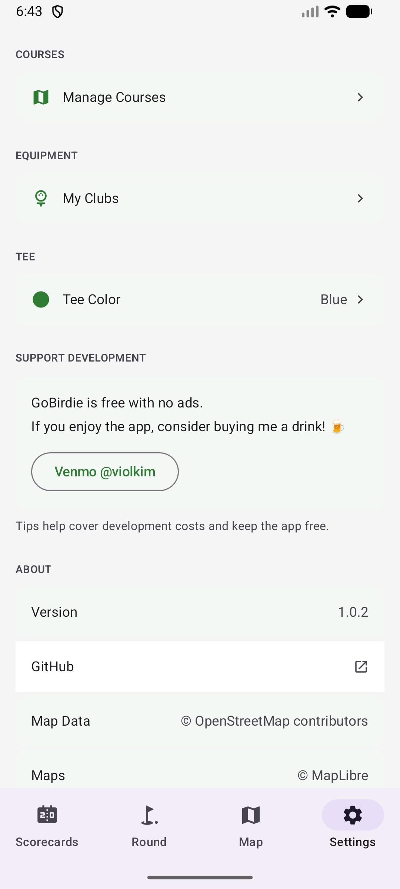</td></tr>
</table>

<table>
<tr><td valign="top">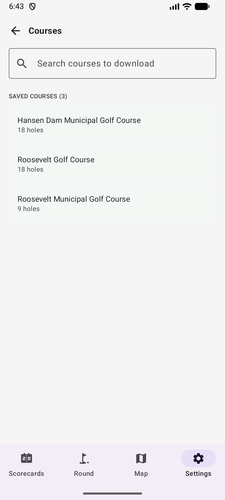</td><td valign="top" width="60%">

### Step 16: Manage Courses

Search and pre-download courses for offline use. View saved courses and swipe to delete ones you no longer need.

</td></tr>
</table>

<table>
<tr><td valign="top" width="60%">

### Step 17: Customize Your Clubs

Toggle clubs on or off to match your actual bag. The club list is used when marking shots during a round.

</td><td valign="top">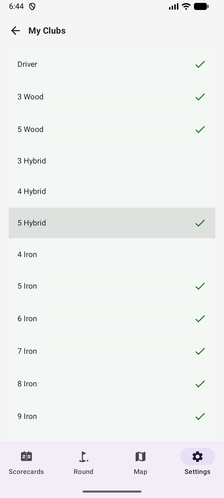</td></tr>
</table>

---

## 7. Wear OS Watch

The Wear OS app works as a companion to the phone — it receives hole data via the Data Layer API and provides quick distance checks and shot tracking from your wrist.

<table>
<tr><td valign="top">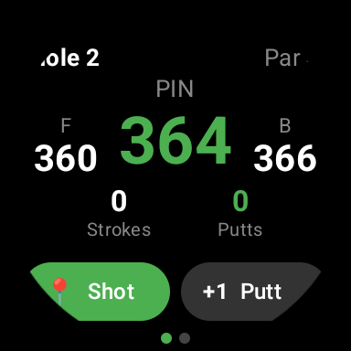</td><td valign="top" width="60%">

### Step 19: Distances & Shot Tracking

When you start a round on the phone, the watch displays live distances to the **Front**, **Pin**, and **Back** of the green, updated continuously from the watch's onboard GPS. Below the distances, your current **Strokes** and **Putts** are shown. Use the buttons to:
- **Shot** — mark a shot at your current GPS location (opens club selection)
- **+1 Putt** — add a putt to the current hole

Swipe or use the rotating crown to navigate between holes. Stroke and putt counts sync automatically with the phone.

</td></tr>
</table>

<table>
<tr><td valign="top" width="60%">

### Step 20: Club Selection on Watch

After tapping **Shot**, a club picker overlay appears. Scroll through your clubs using the rotating crown or swipe, then tap to confirm. The selected club is recorded with the shot and synced to the phone.

</td><td valign="top">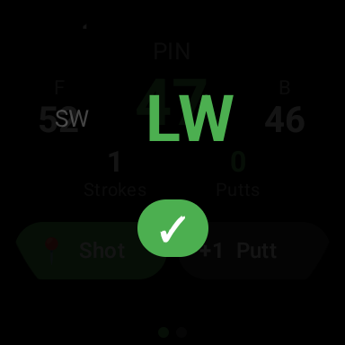</td></tr>
</table>

<table>
<tr><td valign="top">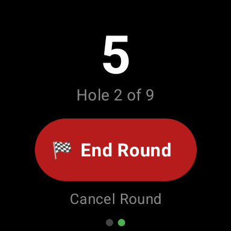</td><td valign="top" width="60%">

### Step 21: End the Round

Swipe to the second page to see your total score and access **End Round** or **Cancel Round**.

</td></tr>
</table>

<table>
<tr><td valign="top" width="60%">

### Step 22: Round Saved

After ending the round, the watch confirms the save with your final score. The round data is sent back to the phone.

</td><td valign="top">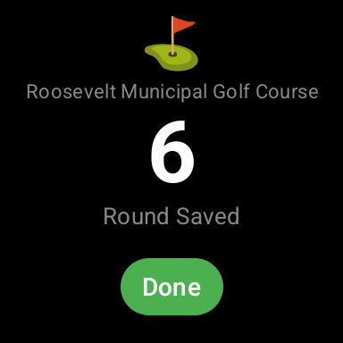</td></tr>
</table>

---

## 8. Exploring Courses

Browse course layouts without tracking a round. This is useful to use the app as a course map and range finder only.

<table>
<tr><td valign="top">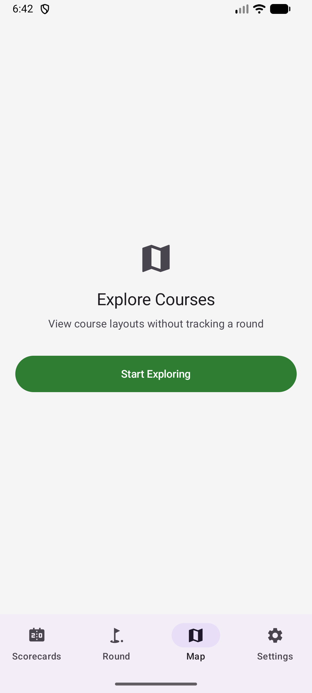</td><td valign="top" width="60%">

### Step 18: Explore a Course

Tap the **Map** tab and select a course to explore. The hole layout is displayed on the map with course geometry (fairways, bunkers, water). Navigate between holes using the **< >** arrows. Tap on the map to measure distances from any point to the green.

</td></tr>
</table>

---

## Tips

- **Customize your clubs** — Go to Settings → My Clubs to toggle clubs on/off (e.g., add a 4-Hybrid, remove 4-Iron)
- **Crash recovery** — The app auto-saves your round every 30 seconds. If the app crashes or your phone restarts, your round will be restored when you reopen
- **Idle detection** — After 30 minutes of no interaction, the app asks "Are you still playing?" to prevent accidental battery drain
- **Orientation lock** — The screen is locked to portrait during a round to prevent accidental rotation
- **Offline courses** — Pre-download courses in Settings → Manage Courses for use without cell service
